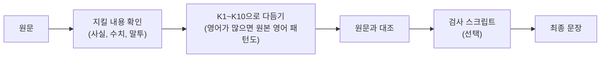

# humanizer-ko — AI 티 나는 글을 사람이 다듬은 글로

[](.claude-plugin/plugin.json)
[](LICENSE)
[](#설치)
[](#설치)
[](https://github.com/blader/humanizer/releases/tag/v3.0.0)

<p align="center">
  
</p>

<p align="center">
  <b>AI로 쓴 초안 → 사람이 다듬은 듯한 한국어</b><br>
  사실과 수치, 글쓴이의 말투는 그대로 두고 어색한 표현만 고칩니다.
</p>

> [!IMPORTANT]
> **당부의 말** — 결국 최종 수정은 사람이 해야 하는 거 아시죠? AI 티는 이 스킬이 걷어 드리지만, 온전히 내 글로 만드는 마지막 손질은 직접 해 주세요.

`humanizer-ko`는 AI가 쓴 듯한 한국어와 영어 문장을 자연스럽게 다듬는 편집 스킬입니다. [blader/humanizer](https://github.com/blader/humanizer)를 바탕으로 한국어 편집 지침을 더한 비공식 포크입니다.

원본은 영어 문장을 기준으로 만들어져서, 대시나 따옴표 규칙을 한국어에 그대로 적용하면 오히려 어색해집니다. 이 한국어판은 번역투 어순, 이중 피동, 조사와 연결어미, 높임말, 한국어 챗봇 상투 문구를 K1~K10에서 따로 점검합니다.

## 무엇이 달라지나

아래는 설명을 위해 지어낸 예시입니다.

**수정 전**

> 이번 프로젝트는 팀의 협업 역량을 보여주는 중요한 이정표가 되었으며, 이해관계자들에 의해 긍정적으로 평가되어졌습니다. 이를 통해 응답 시간을 30% 단축할 수 있었습니다. 도움이 되셨기를 바랍니다!

**수정 후**

> 이번 프로젝트로 응답 시간을 30% 줄였고, 이해관계자들도 결과를 긍정적으로 평가했습니다.

| 바뀐 곳 | 이유 |
|---|---|
| `중요한 이정표가 되었으며` 삭제 | 근거 없이 의미를 부풀린 표현 |
| `평가되어졌습니다` → `평가했습니다` | 이중 피동(K3) |
| `이를 통해 ~할 수 있었습니다` → `~로 줄였고` | 번역투 틀(K2) |
| `도움이 되셨기를 바랍니다!` 삭제 | 챗봇 잔여 문구(K5) |
| `30%`, `긍정적으로 평가` 유지 | 사실과 평가는 건드리지 않음 |

원문에 없는 사실이나 예시, 성과는 새로 만들지 않습니다. 예정된 일을 끝난 일처럼 바꾸거나, 부정문을 빼거나, `WS2`를 `WS₂`로 바꾸는 것처럼 표기를 고치는 것도 하지 않습니다.

## 이럴 때 씁니다

- **AI로 쓴 보고서나 이메일이 어색할 때** — 번역투와 상투 문구를 걷어내고 원래 내용은 남깁니다.
- **발표 대본을 다듬을 때** — 소리 내어 읽기 편한 문장으로 고칩니다(K9).
- **숫자와 기술 용어가 많은 글을 고칠 때** — 수치와 단위, 표기, 제한 조건을 그대로 두고, 필요하면 검사 스크립트로 원문과 대조합니다.
- **내 문체를 유지하고 싶을 때** — 직접 쓴 글을 예시로 주면 그 리듬과 단어 선택을 따릅니다.
- **한영 혼합 문서를 다룰 때** — 영어 문장이 충분히 있으면 원본의 영어 패턴도 함께 봅니다.

AI 탐지기 우회 도구가 아니라 문장 교정 도구입니다.

## 3단계로 시작하기

**1. 설치** — 쓰는 에이전트에 맞춰 한 줄이면 됩니다. 설치한 뒤에는 새 세션을 여세요.

```bash
# Codex
npx skills add choconyam/humanizer-ko --global --agent codex

# Claude Code
npx skills add choconyam/humanizer-ko --global --agent claude-code
```

Claude Desktop, 플러그인, 수동 설치는 아래 [설치](#설치)에 있습니다.

**2. 요청하기** — 스킬을 부르고 글을 붙여 넣습니다. 자연어로 요청해도 됩니다.

```text
/humanizer-ko

[다듬을 글]
```

Codex에서는 `$humanizer-ko`로 부릅니다.

**3. 조건 붙이기(선택)** — 지킬 것을 한 문장으로 덧붙이면 그대로 따릅니다.

```text
이 발표 대본을 자연스럽게 다듬되 수치와 의학적 제한은 그대로 유지해줘.
이 문장을 번역투 없이 다듬고, -합니다 말투를 유지해줘.
docs/launch-post.md의 문장을 자연스럽게 다듬어줘.
```

## 동작 흐름



어떻게 고칠지는 에이전트가 판단합니다. 숫자와 영문 표기가 바뀌었는지처럼 기계로 확인할 수 있는 일은 `scripts/check-rewrite.py`가 맡습니다. 검사 스크립트는 수치와 기술 표기가 많은 글이나 비교 검토를 요청했을 때만 씁니다.

일반 교정에서는 설명 없이 최종 문장만 보여줍니다. 검토나 비교만 요청하면 그 범위에서 답하고, 교정본을 억지로 덧붙이지 않습니다.

## 한국어 점검 항목 K1~K10

K1~K10은 스킬 본문([`SKILL.md`](SKILL.md))에 들어 있어서 한국어 글에는 항상 적용됩니다.

| 항목 | 한국어 전용 점검 사항 |
|---|---|
| K1 | 전체 예의 수준을 지키며 관습적 문체 차이와 무작위 혼용을 구분 |
| K2 | 번역투 어순과 빈 틀을 걷어내고 원문 내용을 자연스러운 한국어 문장으로 표현 |
| K3 | 주어, 대명사, 피동, 복수 표현을 문맥에 맞게 사용 |
| K4 | 같은 내용의 반복과 빽빽한 명사 나열을 풀되 필요한 항목은 모두 보존 |
| K5 | 한국어 AI 상투 표현과 챗봇 잔여 문구를 문맥에 따라 검토 |
| K6 | 조사와 연결어미, `-지 않다`와 `-지 못하다`의 차이를 뜻에 맞게 유지 |
| K7 | 분야에서 실제로 쓰는 용어를 사용하고 기술 토큰을 보호 |
| K8 | 반복되는 문장과 문단을 한국어에 맞는 경계, 인용부호, 리듬으로 조정 |
| K9 | 발표, 강의, 영상 대본을 말하기 편하게 수정 |
| K10 | 의료, 법률, 과학, 금융, 정책 문구의 정확성과 제한 조건을 보존 |

필요할 때만 읽는 참조 문서도 있습니다.

| 문서 | 언제 읽나 |
|---|---|
| [`korean-genres.md`](references/korean-genres.md) | 상투 표현인지 의도한 말투인지 판단이 어렵거나 긴 말하기 대본을 다룰 때 |
| [`fidelity-review.md`](references/fidelity-review.md) | 수치, 조건, 예정과 완료 여부처럼 얽힌 사실이 많아 원문과 꼼꼼히 대조해야 할 때 |
| [`terminology/`](references/terminology/index.md) | 전문용어를 고르거나 번역해야 할 때. 과학, 소프트웨어, 의학, 법률, 금융 분야별로 나뉨 |
| [`english-patterns.md`](references/english-patterns.md) | 영어 문장이 충분히 있을 때. 원본의 영어 패턴을 그대로 가져온 파일 |

영어 쪽은 원본 [blader/humanizer](https://github.com/blader/humanizer)를 그대로 따라갑니다. 패턴 목록과 예시는 [`english-patterns.md`](references/english-patterns.md)나 원본 README에서 볼 수 있습니다.

## 설치

원본 `humanizer`와 이름이 달라서 함께 설치할 수 있습니다. Windows에서는 `~`를 `%USERPROFILE%`로 바꿔 읽으세요.

<details>
<summary><b>Codex</b> — Skills CLI 또는 수동 복제</summary>

```bash
npx skills add choconyam/humanizer-ko --global --agent codex
```

수동으로 설치하려면 저장소를 Codex 스킬 폴더에 복제합니다.

```bash
git clone https://github.com/choconyam/humanizer-ko.git ~/.codex/skills/humanizer-ko
```

Codex에서는 `$humanizer-ko`로 호출하거나 자연어로 요청합니다.

</details>

<details>
<summary><b>Claude Code</b> — Skills CLI, 플러그인, 수동 복사</summary>

```bash
npx skills add choconyam/humanizer-ko --global --agent claude-code
```

플러그인으로도 설치할 수 있습니다. 이때는 `/humanizer-ko:humanizer-ko`로 실행합니다.

```text
/plugin marketplace add choconyam/humanizer-ko
/plugin install humanizer-ko@humanizer-ko
```

수동으로 설치하려면 스킬 파일과 참조 문서, 검사 스크립트를 복사합니다.

```bash
mkdir -p ~/.claude/skills/humanizer-ko/scripts
cp SKILL.md ~/.claude/skills/humanizer-ko/
cp -R references ~/.claude/skills/humanizer-ko/
cp scripts/check-rewrite.py ~/.claude/skills/humanizer-ko/scripts/
```

`skills/humanizer-ko/SKILL.md`는 루트의 `SKILL.md`와 같은 내용이며, 패키지 검사가 두 파일의 일치를 확인합니다.

</details>

<details>
<summary><b>Claude Desktop</b> — 릴리스 ZIP 업로드</summary>

최신 릴리스의 [`humanizer-ko-skill.zip`](https://github.com/choconyam/humanizer-ko/releases/latest/download/humanizer-ko-skill.zip)을 받아 업로드하세요. GitHub의 **Code > Download ZIP**은 업로드용 구조가 아니니 쓰지 마세요.

릴리스 ZIP의 버전은 `main`의 소스 버전과 다를 수 있습니다. 받기 전에 릴리스 태그를 확인하세요.

</details>

<details>
<summary><b>다른 에이전트와 업데이트</b></summary>

지원되는 모든 에이전트에 한 번에 설치합니다.

```bash
npx skills add choconyam/humanizer-ko --global --agent '*'
```

기존 설치본을 업데이트합니다.

```bash
npx skills update humanizer-ko --global
```

현재 프로젝트에만 설치하려면 `--global`을 빼세요. Skills CLI가 지원하지 않는 에이전트라도 스킬 폴더에 `SKILL.md`와 `references/`를 함께 두면 작동합니다.

</details>

## 내 문체에 맞추기

직접 쓴 글을 예시로 함께 주면 그 문장 리듬과 단어 선택, 문장부호 습관을 따릅니다. 예시가 일반 규칙보다 우선합니다.

```text
/humanizer-ko

아래는 내 문체를 보여주는 예시야.
[직접 쓴 문단 2~3개]

이제 다음 글을 같은 문체로 다듬어줘.
[다듬을 글]
```

## 자주 묻는 것

**AI 탐지기를 피하는 도구인가요?** 아니요. 읽는 사람이 어색하게 느끼는 표현을 고치는 교정 도구입니다. 탐지기 점수를 목표로 삼지 않습니다.

**원문에 없는 내용을 넣나요?** 넣지 않습니다. 그럴듯한 장비명이나 원인, 성과를 덧붙이는 것도 창작으로 봅니다. 오타로 보이는 부분은 고치지 않고 표시만 합니다.

**영어 글도 되나요?** 됩니다. 영어 문장에는 원본 humanizer의 영어 패턴을 그대로 적용합니다.

**돈이 드나요?** 스킬은 무료(MIT)입니다. 에이전트 사용량은 본인 계정에서 나갑니다.

## 더 보기

<details>
<summary><b>자세한 동작 원리</b></summary>

`humanizer-ko`는 WikiProject AI Cleanup이 관리하는 위키백과의 ["Signs of AI writing"](https://en.wikipedia.org/wiki/Wikipedia:Signs_of_AI_writing)에 정리된 패턴을 사용합니다.

> LLM은 통계 알고리즘으로 다음에 올 말을 추정합니다. 그 결과는 가장 넓은 상황에 적용될 수 있는, 통계적으로 가장 가능성 높은 표현에 가까워지는 경향이 있습니다.

교정을 요청했을 때의 흐름입니다. 검토만 요청하면 관련 기준으로 문제를 설명하고, 전체 교정본을 만들거나 파일을 수정하지 않습니다.

1. 원문에서 바뀌면 안 되는 내용과 요청 범위를 확인합니다.
2. 한국어 문장은 K1~K10을 적용하고, 영어 문장이 충분할 때만 원본의 영어 패턴을 함께 봅니다.
3. 글 전체를 한 번 다듬은 뒤 원문과 최종안을 대조합니다.
4. 실제 오류가 있으면 바로잡고, 영향을 받은 부분만 다시 확인합니다. 새 근거가 없는데 검사를 되풀이하지 않습니다.

영어 전용 규칙을 한국어에 그대로 옮기지 않고 문장과 문단 전체를 다시 구성합니다. K5 표현은 금칙어나 개수 규칙이 아닙니다. 원문에 있는 불확실성이나 설명, 필요한 나열과 성공했다는 사실, 관습적인 인사말과 본문의 문체 차이, 인사와 감사와 부탁처럼 역할이 다른 표현, 3인칭이나 인용된 화자의 말투는 보존합니다.

영어 제품명이나 코드, 인용, 정착된 기술용어가 섞였다는 이유만으로 영어 상세 규칙을 불러오지 않습니다. 충실도 참조 문서는 분야 이름만 보고 여는 것이 아니라, 서로 얽힌 조건이 얼마나 많고 오류가 어떤 영향을 주는지를 보고 선택합니다. 내용이 바뀌지 않은 지침이 이미 문맥에 있으면 다시 읽지 않습니다.

검사 스크립트는 단어와 수치, 표기처럼 기계적으로 찾을 수 있는 변화만 보여 줍니다. 결과가 사실이나 의미의 오류를 확정하지는 않으며, 최종 판단은 원문과 직접 비교해서 내립니다.

</details>

<details>
<summary><b>긴 글 전체 예시 (리스본 여행기)</b></summary>

**수정 전(AI 문체):**

> 최근 리스본에서 잊지 못할 5일을 보냈는데요. 정말이지 이 도시는 제 마음을 완전히 사로잡았습니다. 도착한 순간부터 아주 특별한 곳에 왔다는 것을 알 수 있었습니다.
>
> 타구스강을 따라 자리 잡은 리스본은 포르투갈의 굳건한 정신을 보여주는 생생한 증거입니다. 풍부한 역사와 현대적인 활력이 곳곳에서 어우러집니다. 물론 유명한 언덕은 만만치 않습니다. 제 다리도 확실히 느꼈습니다! 하지만 오를 때마다 숨 막히게 아름다운 전경이 펼쳐져 모든 수고가 아깝지 않습니다.
>
> 리스본 여행에서 역사적인 동네를 누비는 상징적인 28번 트램을 빼놓을 수 없습니다. 음식은 어떨까요? 그야말로 환상적입니다. 파스테이스 드 벨렘의 원조 에그타르트는 사랑받는 국가적 보물이며, 따뜻할 때 맛본 순간은 영원히 잊지 못할 것입니다.
>
> 하지만 리스본을 특별하게 만드는 것은 단순히 볼거리가 아니라 그곳의 느낌입니다. 큰 광장에서 몇 걸음만 벗어나면 햇살 가득한 골목, 매력적인 타일 외벽, 일상을 보내는 친절한 주민들이 있는 조용하고 진정한 모습을 발견할 수 있습니다. 모두가 여행자에게 속도를 늦추고 매 순간을 음미하라고 권하는 듯합니다.
>
> 꼭 봐야 할 상조르즈성에서는 지붕 너머로 멋진 전망이 펼쳐집니다. 줄이 길 수 있지만 역사 애호가나 호기심 많은 여행자라면 충분히 기다릴 가치가 있습니다.
>
> 다시 갈 생각이 있냐고요? 물론입니다. 리스본은 단순히 방문하는 곳이 아니라 몇 번이고 사랑에 빠지는 곳입니다. 다음 여행지를 꿈꾸고 있다면 평생 간직할 추억을 약속하는 여행지가 바로 이곳입니다. ✨

**수정 후:**

> 최근 리스본에서 잊지 못할 5일을 보냈습니다. 도착한 순간부터 특별한 곳이라는 생각이 들었고, 마음을 사로잡는 도시였습니다.
>
> 타구스강을 따라 자리 잡은 리스본에서는 포르투갈의 오랜 역사와 현대적인 활기를 함께 느낄 수 있었습니다. 유명한 언덕은 만만치 않았지만, 오를 때마다 펼쳐지는 전망을 보면 힘든 것도 아깝지 않았습니다.
>
> 리스본 여행에서는 역사적인 동네를 누비는 28번 트램을 빼놓기 어렵습니다. 음식도 훌륭했습니다. 특히 파스테이스 드 벨렘의 원조 에그타르트를 따뜻할 때 맛본 순간은 잊기 어렵습니다.
>
> 큰 광장에서 몇 걸음만 벗어나면 햇살이 드는 골목과 타일 외벽, 주민들의 일상이 보이는 조용한 풍경이 나타납니다. 그런 길에서는 자연스럽게 걸음을 늦추게 됩니다.
>
> 상조르즈성에서는 지붕 너머로 멋진 전망을 볼 수 있습니다. 줄이 길 수 있지만 역사에 관심이 있거나 호기심 많은 여행자라면 기다릴 만합니다.
>
> 다시 갈 생각은 분명히 있습니다. 리스본은 한 번으로 끝내기보다 몇 번이고 다시 찾고 싶은 도시입니다.

</details>

<details>
<summary><b>원본 따라가기</b></summary>

영어 쪽은 원본을 그대로 따라가고, 한국어 쪽은 이 저장소에서 따로 관리합니다. 지금 따라가는 원본 버전은 [`.upstream-version`](.upstream-version)에 적혀 있고, 원저작자 표기와 한국어판의 변경 범위는 [`NOTICE.md`](NOTICE.md)에 있습니다.

GitHub Actions가 매주 월요일 원본의 새 안정 버전을 확인합니다. 새 버전이 있으면 원본 `SKILL.md`에서 패턴 부분만 잘라 [`english-patterns.md`](references/english-patterns.md)를 새로 만들고, 검증기를 돌린 뒤 초안 PR을 엽니다. 원본의 작업 순서와 출력 방식은 가져오지 않습니다. 저장소 전체를 합치지 않으므로 한국어 파일과 충돌하지 않습니다. PR은 사람이 확인하고 병합합니다.

손으로 하려면 원본 태그를 받은 뒤 스크립트를 돌리면 됩니다.

```bash
git fetch https://github.com/blader/humanizer.git --tags
python scripts/sync-english-patterns.py --tag vX.Y.Z
```

원본의 버전별 변경 사항은 [원본 릴리스](https://github.com/blader/humanizer/releases)에서 보세요.

</details>

## 버전 기록

`ko-1.0.0`부터 이 저장소의 버전은 원본과 따로 셉니다. 한국어판을 고칠 때만 올리고, 따라가는 원본 버전은 배지와 `.upstream-version`에 따로 표시합니다.

- **ko-1.0.0** — 버전 번호를 원본과 분리하고, 영어 패턴을 원본 v3.0.0으로 올렸습니다.
  - **버전:** 이전의 `v2.11.1-ko.13` 다음 버전입니다. 이전 기록은 아래에 그대로 남깁니다.
  - **영어 패턴:** 원본 v3.0.0에 맞춰 35개에서 25개로 바뀌었습니다. 원본 `SKILL.md`에서 패턴 부분만 잘라 오는 `scripts/sync-english-patterns.py`를 추가했습니다. 원본의 작업 순서와 출력 방식은 가져오지 않고, 영어 규칙을 한국어 문장에 쓰지 않는다는 안내를 파일 머리에 둡니다.
  - **자동 동기화:** 원본 새 버전이 나오면 영어 패턴 파일만 바꾸는 초안 PR을 만듭니다. 전에는 저장소 전체를 합치려다 한국어 파일과 충돌해 멈췄습니다.
  - **검사:** 영어 패턴 개수를 35개로 고정하지 않고 1번부터 빠짐없이 이어지는지 봅니다. 영어 패턴 파일이 기록된 원본 버전과 일치하는지도 확인합니다.
  - **README:** 영어 패턴 표와 원본 릴리스 목록을 원본 링크로 바꿨습니다.
  - **유지:** K1~K10과 한국어 편집, 사실 보존 규칙은 바뀌지 않았습니다. 품질 변화는 이번에 측정하지 않았습니다.

<details>
<summary><b>이전 포크 릴리스 보기</b></summary>

버전 번호를 바꾸기 전(`v2.11.1-ko.1`~`ko.13`)의 기록입니다.

- **v2.11.1-ko.13** — 요청한 범위에서 정확히 끝내고, 필요한 검토만 수행하도록 작업 흐름과 지침 배치를 정리했습니다.
  - **수정 — 요청 범위:** 검토·비교·설명만 요청했을 때 전체 교정본을 붙이거나 파일을 수정하지 않도록 했습니다.
  - **개선 — 참조 로딩:** 충실도 지침은 분야 이름보다 내용의 복잡성과 오류의 영향을 기준으로 읽습니다. 문맥에 남아 있는 변경 없는 지침은 재사용합니다.
  - **개선 — 오류 수정과 종료:** 기본 교정과 원문 대조 후 실제 오류를 고치고 관련 부분을 재확인합니다. 원문이 모호하면 추측하지 않으며, 새 문제 없이 검사를 반복하지 않습니다.
  - **정리 — 중복 검사:** 최종 확인 절차를 하나로 합쳤습니다. 핵심 보존 원칙은 본문에, 탐지 구현은 선택형 검사기에 두도록 개발 지침을 정리했습니다.
  - **문서:** 빠른 이동 목차를 추가하고 이전 버전 기록을 접었습니다. 릴리스 ZIP과 소스의 버전이 다를 수 있음을 안내합니다.
  - **유지:** K1~K10의 구성과 한국어 편집·사실 보존 원칙, upstream 영어 35개 패턴을 유지합니다. 품질·비용 변화는 이번 업데이트에서 측정하지 않았습니다.
- **v2.11.1-ko.12** — 한국어는 단어를 기계적으로 지우기보다 문장·문단 전체를 다듬고, 이미 자연스러운 표현과 필요한 나열·인사·화자 말투·성공 여부를 보존하며 `-지 않다`와 `-지 못하다`를 구분합니다. 일반 교정은 한 번의 전체 수정과 원문 대조로 끝내고, 추가 안내는 판단이 어려울 때만 읽으며 검증 도구는 요청된 검토나 수치·기술 정보가 많은 글에서만 선택적으로 씁니다. 일반 영어 단어를 기술용어로 잘못 경고하던 문제를 줄이고, 부호·단위·코드 변경 감지를 보강했습니다. 원본·패키지 복사본과 라이선스·고지 파일의 누락이나 불일치를 검사하고, 문서 예시는 원문에 없는 내용을 만들지 않도록 바로잡았습니다.
- **v2.11.1-ko.11** — 구조를 뒤집었습니다. 한국어 점검 항목 K1~K10을 조건부로 읽던 참조 파일에서 스킬 본문(`SKILL.md`)으로 옮겨 한국어 글에는 항상 적용되게 했고, upstream 영어 35개 패턴만 영어 문장이 충분할 때 읽는 참조로 남겼습니다. 조건부 로딩이 건너뛰어져 규칙 없이 교정되던 실패 경로를 없앴습니다. Codex용 `.codex-plugin/plugin.json`과 Windows 호환 패키지 복사본을 추가했습니다.
- **v2.11.1-ko.10** — Codex 실사용에서 확인된 사실 창작 사례를 막는 업데이트입니다. 원문에 없는 장비명·원인·성과를 덧붙이는 것도 발명임을 항상 읽는 본체 규칙에 명시하고, 표기(`WS2`↔`WS₂`)와 한글 음차↔영어 전환, 청구항류 문언 변경을 금지했습니다. 오타로 보이는 토큰은 고치지 않고 표시합니다. 숫자나 영문 기술 용어가 있는 글에서는 충실도 가이드를 기본으로 읽게 했고, `check-rewrite.py`가 교정문에 새로 생긴 영문 토큰과 숫자도 사실 오류로 잡습니다. K5의 중복 항목을 정리했습니다.
- **v2.11.1-ko.9** — 벤치마크에 남아 있던 실패 사례를 바탕으로 판정을 조였습니다. 상투 표현을 남기려면 어떤 예외(인용, 승인 문구, 근거, 행동이 있는 약속, 안전 강조, 글쓴이의 1인칭 경험)에 해당하는지 지목해야 합니다. `다양한` 처리, 완료 동사 앞 `성공적으로` 잉여 규칙, `단순한 X가 아니라 Y` 수사 프레임, 영어 개념어 직역(voice→`목소리`) 예시를 추가했습니다. 압축 단계에서 사실을 한정하는 부정문(`입증되지 않았다` 등)은 자르지 않도록 명시하고, `check-rewrite.py`에 부정 표현 급감 경고를 넣었습니다. 문서에서는 버전 기록의 ko.6 항목을 되살리고 출처 문단을 다듬었습니다.
- **v2.11.1-ko.8** — 가운뎃점 사슬 검토 항목을 K4에 추가했습니다. 세 개 이상 명사를 `·`로 잇는 나열이 반복되면 명사 나열의 신호로 보고, 공문·표제·기술 규격처럼 장르가 요구할 때만 유지하며 일반 산문에서는 항목을 줄이거나 문장으로 풀어 씁니다.
- **v2.11.1-ko.7** — A/B/C 블라인드 비교에서 확인한 상투어 유의어 치환, 예의 표현 중첩, 다짐형 결말 문제를 보강했습니다. 최종 압축 단계와 선택형 검증 스크립트 `check-rewrite.py`를 추가했습니다.
- **v2.11.1-ko.6** — ko.7에 이어진 중간 버전입니다. 상투어를 비슷한 말로 바꾸지 않고 지우는 삭제 테스트와 압축 단계를 처음 도입했습니다. 별도 릴리스 없이 ko.7에 포함되었습니다.
- **v2.11.1-ko.5** — A/B 비교 결과를 바탕으로 라우팅 프롬프트와 한국어 K1~K10 핵심 가이드를 축약했습니다. 영어 35개 상세 패턴은 영어 문장 구간이 충분할 때만 불러오며, 전문용어 지침은 작은 문맥 라우터와 과학·소프트웨어·의학·법률·금융 가이드로 나눠 필요한 분야만 읽습니다. 단어가 남았는지만 보는 방식 대신 문맥에 맞춰 한국어 상투 표현을 검토하고, 정상적인 인사·공식 약속·안전 강조·개인 문체·승인된 광고를 보존하도록 장르 지침을 추가했습니다. 사실과 의미를 보존하는 충실도 검사도 추가했습니다. 날짜·수치·단위·인용·출처·전문용어는 그대로 유지하고, 부정·조건·예외·범위·시제·불확실성·인과관계·검증 상태·예정 및 완료 여부와 분야별 제한 조건이 달라지지 않았는지 확인합니다. 일반 교정에서는 설명을 덧붙이지 않고 최종 교정문만 반환합니다.
- **v2.11.1-ko.4** — K8에 쉼표·연결어미로 여러 절을 이어 붙인 긴 문장을 끊는 지침과 예시를 추가했습니다. K10을 특정 분야 목록이 아니라 "오류가 실제 피해를 낳는 모든 분야"로 넓히고, 분야별 용어 표에 예시를 더해 어떤 전문 분야에도 같은 방식이 적용됨을 분명히 했습니다. 이와 함께 공개 후 설치 안내 문구를 정리하고 README의 언어 전환 링크를 굵게 강조했습니다.
- **v2.11.1-ko.3** — 설치 안내를 Codex·Claude Code·Claude Desktop 기준으로 재구성하고 한국어판 소개를 추가했습니다. Claude Desktop 패키지에 LICENSE와 NOTICE를 동봉하고, 위키백과 CC BY-SA 4.0 표기, 국립국어원 등 한국어 용어 출처와 단발 조회 원칙을 추가했습니다.
- **v2.11.1-ko.2** — 한국어 피동·이중 피동, 번역투 동사, 한국어 챗봇 잔여 문구와 상투 표현, K3~K6·K8의 수정 전후 예시, 한국어 인용부호 예외를 추가했습니다.
- **v2.11.1-ko.1** — 기존 한국어·Codex 현지화를 upstream v2.11.1로 옮겼습니다. 영어 중심 upstream 패턴은 유지하고 한국어 전용 점검 항목 K1~K10, 분야별 용어 처리, 현지화 패키지 검사, 출처 표기, upstream 동기화 초안 PR 자동화, 구분되는 `humanizer-ko` 표시·호출명을 추가했습니다.

</details>

## 출처

- [Wikipedia: Signs of AI writing](https://en.wikipedia.org/wiki/Wikipedia:Signs_of_AI_writing) — 주요 출처
- [WikiProject AI Cleanup](https://en.wikipedia.org/wiki/Wikipedia:WikiProject_AI_Cleanup) — 출처 문서 관리
- 위키백과 문서 본문은 [CC BY-SA 4.0](https://creativecommons.org/licenses/by-sa/4.0/deed.ko)을 따릅니다.
- [국립국어원 한국어 어문 규범](https://korean.go.kr/kornorms) — 맞춤법, 문장부호, 외래어 표기의 기본 기준
- [국립국어원 표준국어대사전](https://stdict.korean.go.kr/) — 표준어형과 뜻풀이 확인
- 분야별 용어를 확인할 때 참고하는 출처(TTA 정보통신용어사전, 국가법령정보센터 등)는 [`references/terminology/`](references/terminology/index.md)에 정리되어 있습니다.

## 라이선스

MIT 라이선스를 사용합니다. Upstream의 저작권과 허가 고지는 [`LICENSE`](LICENSE)에 그대로 유지되어 있습니다. 원저작자 표기와 기준 버전, 현지화 변경 사항은 [`NOTICE.md`](NOTICE.md)에서 확인하세요.

---

> 이 README는 GitHub 방문자를 위한 안내입니다. 에이전트가 실제로 읽는 규칙은 [`SKILL.md`](SKILL.md)와 [`references/`](references/)에 있습니다.
